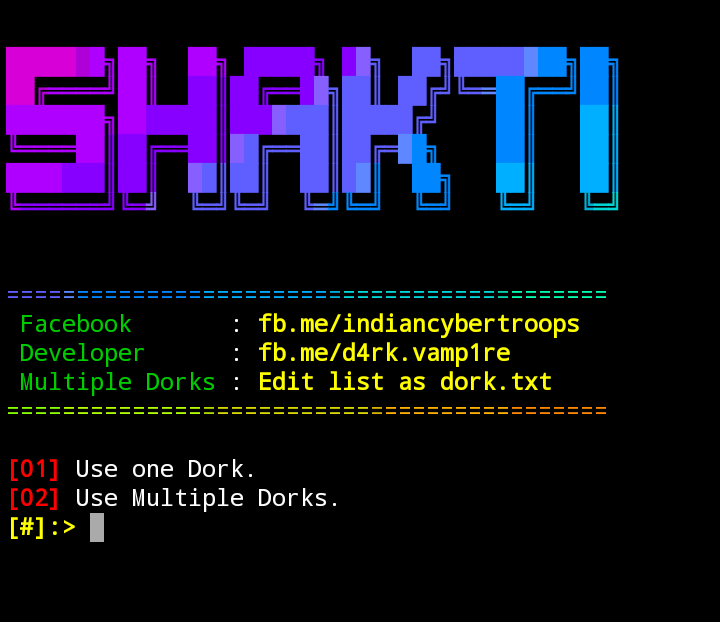

# Shakti
Multi thread And Single thread google dorker written in bash



## Command to run on Termux 


```
git clone https://github.com/indiancybertroops/Shakti/
```
```
cd Shakti
```
```
chmod +x *
```
```
sh setup.sh
```


## On linux :

```
git clone https://github.com/indiancybertroops/Shakti/
```

```
cd Shakti
```

```
chmod +x *
```

```
sh setup.sh
```


## Save your dork txt file as dorks.txt


## sample Dork:
> dorks already given in dork.txt file
 ```inurl:add.php?id= site:cn```

```inurl:product.php?id= site:pk```
 
```inurl:cat?id= site:uk```
### Any problem? 
>Try this 
```
apt-get update
```
>upgrade pip first before this

```
apt-get upgrade -y
```

> For Automatically installation of module try this command
```
chmod +x *
```
```
sh setup.sh
```

## Contact Us: 
https://facebook.com/indiancybertroops
https://instagram.com/indiancybertroops
https://twitter.com/indiancybertroops
